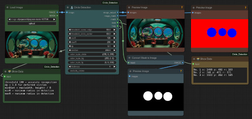
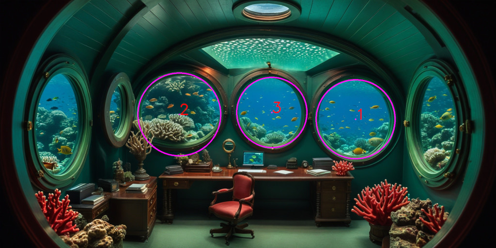

# ComfyUI Circle Detection  

## Introduction

Next to AI mathematical methods can be used for the detection of objects like a circle. This node is using Hough's transform for the detection of circles in an given image. The advantage of mathematical methods is that the recognised circles can be virtually predicted. I utilise this to create masks.

## Usage

After installation the node can be find in the node menu

* Add Node > 🧬 Circle Detection Nodes > 🔬 Circle Detection

For showing data one can use following node

* Add Node > 🧬 Circle Detection Nodes > 🗃 Circle Detection

The first 

## What the Node Does

The input of the node is an image. The output of the node is

+ image_output
+ image_mask
+ mask
+ data
+ help

The help output can be shown with an text/string ouptput node. 

Settings:

- threshold_canny_edge
- threshold_circle_center
- minR
- maxR
- dp
- minDist
- color_tuple_cicles
- color_tuple_bg
- color_tuple_fg
- thickness
- exclude_circles

## Version Previews

version 0.0.0.1

*Figure 1: Preview of workflow using the circle detection node* 

version 0.0.0.2

*Figure 2: Preview of workflow using the circle detection node* 

version 0.0.0.3

*Figure 3: Preview of workflow using the circle detection node* 

## Installation

Use the ComfyUI Manager for the installation of the node.

You can also move int the directory ComfyUI/custom_nodes

<code>git clone https://github.com/zentrocdot/ComfyUI_Circle_Detection</code>

# Example

<i>Figure 4: Original image</i>

<i>Figure 5: Image with circles detected</i>

# To-Do

Troubleshooting in the node programming and sanitizing up the code.

## Remarks

The first image created is the one, where on can see, which circles are found. The seond image looks like a mask, but it is not for the moment. 
It is still an blank image, where the found circles are filled drawn. This changed in version 0.0.0.3.

## References

[1] https://docs.opencv.org/3.4/d4/d70/tutorial_hough_circle.html
[2] https://github.com/exectails/comfyui-et_infoutils
